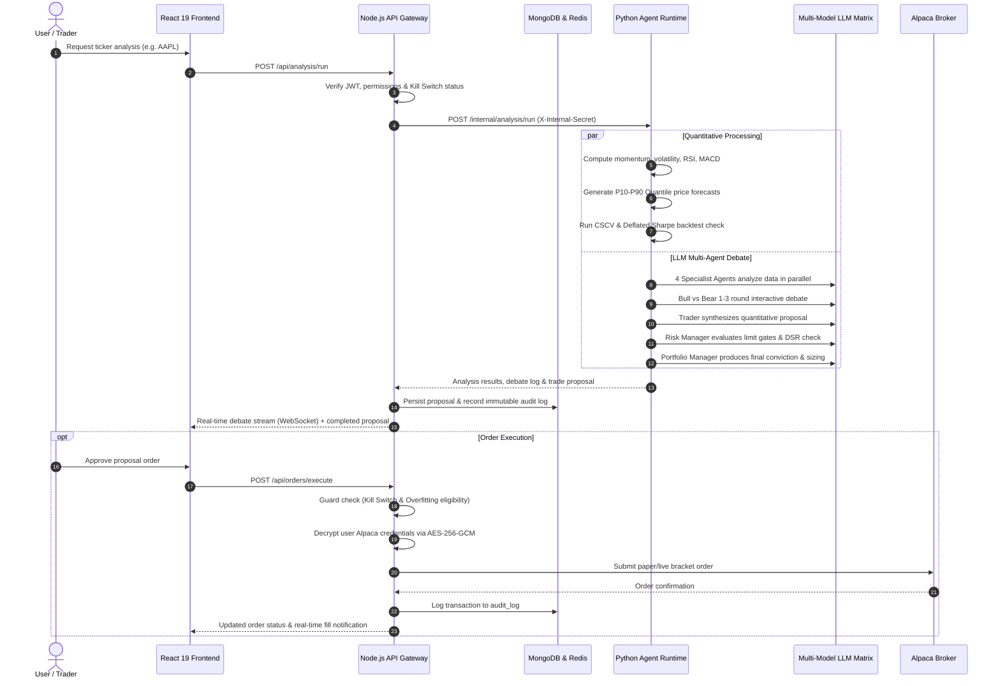

# TradeX — Hybrid Multi-Agent Quantitative Trading Platform

> **Production-grade, end-to-end multi-agent quantitative trading advisory, statistical forecasting, and automated execution platform.**

---

## Table of Contents

- [System Architecture](#system-architecture)
  - [High-Level Flow Diagram](#high-level-flow-diagram)
  - [End-to-End Data Pipeline](#end-to-end-data-pipeline)
- [Monorepo Project Layout](#monorepo-project-layout)
- [Frontend Application (`frontend/`)](#frontend-application-frontend)
  - [Tech Stack & Tooling](#tech-stack--tooling)
  - [Key Views & Features](#key-views--features)
  - [State Management & Real-Time Sync](#state-management--real-time-sync)
- [Backend API Gateway (`server/apps/api/`)](#backend-api-gateway-serverappsapi)
  - [Core Responsibilities](#core-responsibilities)
  - [REST API Routes Reference](#rest-api-routes-reference)
  - [WebSocket Events](#websocket-events)
  - [Shared Schema Validation (`@confluence/shared-schemas`)](#shared-schema-validation-confluenceshared-schemas)
- [Python Agent Runtime Service (`server/apps/agent-runtime/`)](#python-agent-runtime-service-serverappsagent-runtime)
  - [Microservice Architecture](#microservice-architecture)
  - [Internal API Endpoints](#internal-api-endpoints)
- [Specialized Multi-Model LLM Routing](#specialized-multi-model-llm-routing)
  - [Agent Role & Model Matrix](#agent-role--model-matrix)
  - [Multi-Agent Debate Graph Workflow](#multi-agent-debate-graph-workflow)
- [Quantitative & Statistical Engines](#quantitative--statistical-engines)
  - [1. Quant Factor Engine](#1-quant-factor-engine)
  - [2. Probabilistic Quantile Forecasting](#2-probabilistic-quantile-forecasting)
  - [3. Overfitting & Robustness Gate](#3-overfitting--robustness-gate)
  - [4. RL-Assisted Position Sizing](#4-rl-assisted-position-sizing)
- [Enterprise Safety Rails & Security](#enterprise-safety-rails--security)
- [Environment Configuration](#environment-configuration)
- [Quick Start & Setup Guide](#quick-start--setup-guide)
  - [Option A: Docker Compose (Recommended)](#option-a-docker-compose-recommended)
  - [Option B: Manual Local Development](#option-b-manual-local-development)
  - [Running the Test Suites](#running-the-test-suites)
- [License](#license)

---

## System Architecture

TradeX unifies multi-model generative AI debate workflows with quantitative statistical rigor, algorithmic risk checks, and real-time order routing.

### High-Level Flow Diagram

```
                                ┌──────────────────────────────────────────────┐
                                │           CONFLUENCE SYSTEM ARCHITECTURE     │
                                └──────────────────────┬───────────────────────┘
                                                       │
         ┌─────────────────────────────────────────────┼─────────────────────────────────────────────┐
         │                                             │                                             │
         ▼                                             ▼                                             ▼
  [ FRONTEND SPA ]                            [ API GATEWAY ]                             [ PYTHON RUNTIME ]
  React 19 + TypeScript + Vite                Node.js + Express + Socket.IO               FastAPI Microservice (Port 8000)
  • Real-time trading dashboard               • JWT Auth & AES-256 Key Vault              • MultiAgentDebateGraph orchestration
  • Lightweight Charts (OHLCV)                • BullMQ job queues + Redis pub/sub         • Qlib factor mining & normalization
  • Bull vs Bear debate transcripts           • Alpaca Broker order execution             • GluonTS probabilistic forecasting
  • Overfitting gate metrics                  • Immutable MongoDB audit trails            • DSR/PBO overfitting validation
  • Emergency kill switch                     • Zod schemas (@confluence/shared-schemas)  • Fractional Kelly position sizing
         │                                             │                                             │
         └──────────────────────┬──────────────────────┘                                             │
                                │                                                                    │
                                └──────────────────────────────┬─────────────────────────────────────┘
                                                               │
                                ┌──────────────────────────────┴──────────────────────────────┐
                                │                                                             │
                                ▼                                                             ▼
                       [ EXTERNAL BROKER ]                                          [ SPECIALIZED LLMs ]
                       Alpaca Paper / Live API                                      Groq / Gemini / Mistral / NVIDIA
                       • Place / cancel orders                                      • DeepSeek-R1 (Groq) for Technical & Debate
                       • Fetch positions & balances                                 • Gemini 2.0 Flash for Fundamentals & Sentiment
                       • Real-time OHLCV market data                                • Mistral Large for News catalyst filtering
                       • Webhook fills & order updates                              • Claude / GPT-6 for Risk & Portfolio Decisions
```

### End-to-End Data Pipeline



---

## Monorepo Project Layout

```
.
├── README.md                      # Unified architecture & documentation (this file)
├── .gitignore                     # Monorepo git ignore rules
│
├── frontend/                      # React 19 SPA client
│   ├── index.html                 # HTML shell
│   ├── vite.config.ts             # Vite build & proxy config
│   ├── tailwind.config.ts         # Tailwind styling tokens
│   ├── package.json               # Frontend dependencies & scripts
│   └── src/
│       ├── main.tsx               # Client entry point
│       ├── App.tsx                # App shell, routing & route guards
│       ├── index.css              # Global styles & design system
│       ├── components/
│       │   ├── layout/            # AppShell, TopBar, Sidebar
│       │   ├── auth/              # RouteGuards (RequireAuth, RedirectIfAuth)
│       │   ├── charts/            # TradingView Lightweight Charts & Portfolio Recharts
│       │   ├── analysis/          # AI Analyst Breakdown & Debate Viewer
│       │   ├── agents/            # Multi-agent status & performance cards
│       │   ├── risk/              # Risk gauge, VaR & kill switch controls
│       │   ├── news/              # News catalyst & sentiment feed
│       │   └── common/            # Metric cards, modals, badges, loaders
│       ├── pages/
│       │   ├── LandingPage.tsx    # Material Design 3 white-theme landing page
│       │   ├── AuthPage.tsx       # Login & registration
│       │   ├── OnboardingPage.tsx # API keys & risk tolerance wizard
│       │   ├── DashboardPage.tsx  # Mission control (Charts, Debate, Proposals)
│       │   ├── WatchlistPage.tsx  # Monitored tickers & quant factors
│       │   ├── ProposalsPage.tsx  # Agent proposals & execution approvals
│       │   ├── BacktestsPage.tsx  # DSR, PBO & CSCV overfitting metrics
│       │   ├── OrdersPage.tsx     # Order history, positions & executions
│       │   └── SettingsPage.tsx   # Broker credentials, LLM keys & risk rules
│       ├── services/              # API clients & mock fallback data
│       └── store/                 # Zustand global stores (auth, trading, ui)
│
└── server/                        # Backend microservices & shared packages
    ├── docker-compose.yml         # Container orchestration (Mongo, Redis, API, Runtime)
    ├── .env.example               # Unified environment configuration template
    ├── package.json               # Monorepo workspace orchestration
    ├── packages/
    │   └── shared-schemas/        # Cross-stack Zod schemas & TypeScript types
    │       └── src/index.ts       # Shared validation models (proposals, orders, quant)
    └── apps/
        ├── api/                   # Node.js + Express + Socket.IO API Gateway
        │   ├── Dockerfile         # Production container definition
        │   ├── vitest.config.ts   # Vitest unit & integration test configuration
        │   ├── src/
        │   │   ├── server.ts      # Express server & Socket.IO initialization
        │   │   ├── config/        # Environment parser & Redis connection
        │   │   ├── db/            # MongoDB connection & Mongoose schemas
        │   │   ├── middleware/    # Auth, RBAC, Rate Limiting, Kill Switch Guard
        │   │   ├── services/      # AES-256 encryption, Alpaca broker, Audit logger
        │   │   ├── routes/        # REST API endpoints
        │   │   └── websocket/     # Real-time WebSocket event broadcaster
        │   └── test/              # Vitest test suite (Auth, Alpaca, Kill Switch, etc.)
        │
        └── agent-runtime/         # Python 3.11 + FastAPI Quantitative ML Microservice
            ├── Dockerfile         # Python 3.11 slim container definition
            ├── requirements.txt   # FastAPI, NumPy, Pandas, Scipy, GluonTS dependencies
            ├── app/
            │   ├── main.py        # FastAPI entrypoint & internal route handlers
            │   ├── config.py      # LLM model mapping & internal secret settings
            │   ├── schemas/       # Pydantic schemas for quant & agent requests
            │   ├── llm/           # LLM router with failovers & circuit breakers
            │   ├── agents/        # MultiAgentDebateGraph & specialized system prompts
            │   ├── quant/         # Qlib factors & PurgedCV/CSCV overfitting validator
            │   ├── forecasting/   # GluonTS probabilistic quantile forecast engine
            │   └── execution/     # FinRL fractional Kelly position sizing engine
            └── tests/             # Pytest test suite (Quant factors, LLM router)
```

---

## Frontend Application (`frontend/`)

### Tech Stack & Tooling

| Layer | Technology | Purpose |
|---|---|---|
| **Framework** | **React 19** + **TypeScript** | Strict component-driven UI architecture |
| **Build Tool** | **Vite 8** | Instant HMR and optimized production bundling |
| **Styling** | **TailwindCSS 3** + **Lucide Icons** | Ultra-responsive institutional dark-mode UI |
| **State Management** | **Zustand** | Lightweight client stores (Auth, Tickers, Active Debate) |
| **Server State** | **TanStack React Query v5** | Automated caching, optimistic updates & polling |
| **Charts** | **Lightweight Charts** & **Recharts** | Interactive candlestick OHLCV & portfolio equity curves |
| **Animations** | **Framer Motion** | Micro-interactions and live debate transitions |
| **Validation** | **Zod** + `@confluence/shared-schemas` | Zero-mismatch client-server validation contracts |

### Key Views & Features

- **Trading Dashboard (`DashboardPage.tsx`)**:
  - Live TradingView-grade Candlestick charts with overlayed Quant indicators.
  - Interactive multi-agent debate view with streaming agent messages.
  - Real-time consensus meter (Bull vs Bear conviction score).
  - One-click order execution card with pre-computed position sizes.
- **Proposals & Consensus (`ProposalsPage.tsx`)**:
  - Transparent trade proposals with detailed reasoning breakdowns.
  - Risk Manager sign-off status and backtest qualification badges.
- **Backtesting & Overfitting Studio (`BacktestsPage.tsx`)**:
  - Combinatorially Symmetric Cross-Validation (CSCV) distribution graphs.
  - Deflated Sharpe Ratio (DSR) & Probability of Backtest Overfitting (PBO).
  - Visual Paper-Trading Eligibility flag.
- **Risk Management & Kill Switch (`SettingsPage.tsx`)**:
  - Global emergency kill switch with immediate visual state feedback.
  - Max drawdown limits, max leverage, and stop-loss enforcement rules.
  - AES-256 encrypted credential management for Alpaca and LLM providers.

### State Management & Real-Time Sync

```
  WebSocket Stream (Socket.IO) ──► Zustand Store (useDebateStore) ──► React Components
  REST API (React Query v5)     ──► Zustand Store (useAuthStore)   ──► Route Guards
```

---

## Backend API Gateway (`server/apps/api/`)

The API Gateway is the central nervous system of TradeX, built with **Node.js**, **Express**, and **TypeScript**.

### Core Responsibilities

1. **Authentication & RBAC**: JWT in secure HTTP-only cookies; fine-grained role authorization (`viewer`, `trader`, `admin`).
2. **Credential Vault**: AES-256-GCM encryption with unique 12-byte IV and 16-byte authentication tags. Keys are decrypted exclusively in-memory when communicating with external APIs.
3. **Execution Guardrails**:
   - `requireKillSwitchDisengaged`: Middleware that instantly blocks any trading action if the kill switch is triggered.
   - `requireOverfittingGateEligible`: Prevents order dispatch if the strategy fails DSR or PBO thresholds.
4. **Broker Integration**: Native Alpaca Markets API wrapper handling account equity, portfolio positions, buying power, and paper/live order placement.
5. **Real-time Event Streaming**: Socket.IO server emitting live LLM agent debate tokens, quant factor updates, and order fill confirmations.
6. **Immutable Audit Logging**: Append-only MongoDB collection tracking all trades, configuration changes, and kill switch activations.

### REST API Routes Reference

| Method | Endpoint | Description | Guard / Middleware |
|---|---|---|---|
| `POST` | `/api/auth/register` | Register new user | Public |
| `POST` | `/api/auth/login` | Authenticate user & issue JWT | Public |
| `POST` | `/api/auth/logout` | Clear session cookie | Auth required |
| `GET` | `/api/auth/me` | Fetch active user profile | Auth required |
| `GET` | `/api/watchlist` | Get user's monitored tickers | Auth required |
| `POST` | `/api/watchlist` | Add ticker to watchlist | Auth required |
| `POST` | `/api/analysis/run` | Trigger multi-agent debate analysis | Auth required, Rate-limited |
| `GET` | `/api/analysis/:id` | Fetch full analysis & debate logs | Auth required |
| `GET` | `/api/proposals` | List generated trading proposals | Auth required |
| `POST` | `/api/proposals/:id/approve` | Approve proposal for execution | Auth + Kill Switch Guard |
| `POST` | `/api/orders/execute` | Place order with Alpaca | Auth + Kill Switch Guard |
| `GET` | `/api/orders` | Fetch user order history & positions | Auth required |
| `POST` | `/api/kill-switch/engage` | Immediately freeze all trading | Admin / Authorized Trader |
| `POST` | `/api/kill-switch/disengage`| Re-enable trading operations | Admin / Authorized Trader |
| `GET` | `/api/backtests` | Retrieve backtest validation metrics | Auth required |
| `GET` | `/api/audit-log` | Query immutable security audit log | Admin required |
| `GET` | `/health` | Gateway health check & DB status | Public |

### WebSocket Events

- `debate:started`: Emitted when an analysis workflow begins.
- `debate:chunk`: Real-time streaming tokens from the active LLM agent.
- `debate:agent_finished`: Fired when a specialist completes its perspective.
- `debate:consensus`: Final consensus score, decision (BUY/SELL/HOLD), and sizing.
- `order:status`: Live updates from broker fill webhooks.
- `kill_switch:state_changed`: Broadcast instantly to all connected clients.

### Shared Schema Validation (`@confluence/shared-schemas`)

A dedicated TypeScript workspace package (`packages/shared-schemas`) containing shared **Zod** models:
- Analysis request/response schemas.
- Trade proposal definitions.
- Broker order parameters.
- Quant factor & forecasting payloads.
- Both Frontend and API import from `@confluence/shared-schemas`, guaranteeing zero drift between client and server.

---

## Python Agent Runtime Service (`server/apps/agent-runtime/`)

A dedicated **Python 3.11 + FastAPI** microservice optimized for high-performance quantitative computation and LLM orchestration.

### Microservice Architecture

- **Asynchronous Execution**: Powered by `asyncio` for concurrent multi-model API requests.
- **Internal Security**: All endpoints enforce `X-Internal-Secret` header validation against `AGENT_RUNTIME_INTERNAL_SECRET`.
- **Fault-Tolerant Router**: Circuit breaker patterns with automatic failover to fallback models upon rate limits or timeouts.

### Internal API Endpoints

| Method | Endpoint | Handler | Description |
|---|---|---|---|
| `GET` | `/health` | `health()` | Returns service status and configured LLM models |
| `POST` | `/internal/analysis/run` | `run_analysis()` | Executes full MultiAgentDebateGraph workflow |
| `POST` | `/internal/quant/compute-factors` | `compute_factors()` | Calculates 5-factor normalized quantitative score |
| `POST` | `/internal/forecasting/predict` | `predict_forecast()` | Generates multi-horizon probabilistic quantiles |
| `POST` | `/internal/quant/backtest` | `run_backtest()` | Computes DSR and PBO validation |
| `POST` | `/internal/execution/size` | `calculate_size()` | Calculates fractional Kelly sizing with volatility penalty |

---

## Specialized Multi-Model LLM Routing

TradeX avoids generic single-model bottlenecks. Instead, it routes each sub-task to the specific LLM architecture optimized for that domain.

### Agent Role & Model Matrix

| Agent Role | Primary Provider | Specialized Model | Justification & Task |
|---|---|---|---|
| **Technical Analyst** | **Groq** | `deepseek-r1-distill-llama-70b` | Ultra-fast inference (<500ms) for high-frequency indicator evaluation & price action |
| **Bull vs Bear Debate** | **Groq** | `deepseek-r1-distill-llama-70b` | Rapid back-and-forth interactive debate rounds to challenge assumptions |
| **Fundamentals Analyst** | **Google Gemini** | `gemini-2.0-flash` | Massive context window to ingest 10-K, 10-Q reports, balance sheets & cash flows |
| **Sentiment Analyst** | **Google Gemini** | `gemini-2.0-flash` | High-volume ingestion of social sentiment feeds (Twitter/X, Reddit, financial news) |
| **Macro Analyst** | **NVIDIA NIM** | `meta/llama-3.3-70b-instruct` | Ingests macro yield curves, central bank interest rates, and inflation trends |
| **News Analyst** | **Mistral** | `mistral-large-latest` | Exceptional multilingual reasoning for catalyst classification & noise filtering |
| **Trader Proposal** | **Agent Router** | `deepseek-v4-flash` | Synthesizes all inputs into an actionable quantitative trade thesis |
| **Risk Manager (Veto)** | **Agent Router** | `claude-opus-4.8` | Rigorous mathematical reasoning, risk limit enforcement, backtest gate compliance |
| **Portfolio Manager** | **Agent Router** | `gpt-6-astra` | Final arbiter: assigns portfolio weighting, execution timing & calibrated confidence |
| **Universal Fallback** | **OpenRouter** | `deepseek/deepseek-r1` | Auto-routes if any primary provider reaches quota or experiences high latency |

### Multi-Agent Debate Graph Workflow

```
                                  ┌─────────────────────────────┐
                                  │      INPUT MARKET DATA      │
                                  │ (OHLCV, Financials, News)   │
                                  └──────────────┬──────────────┘
                                                 │
                   ┌─────────────────────────────┼─────────────────────────────┐
                   │                             │                             │
                   ▼                             ▼                             ▼
        [ Technical Analyst ]         [ Fundamentals Analyst ]        [ Macro & News Analyst ]
           Groq DeepSeek-R1              Gemini 2.0 Flash                 Mistral / NVIDIA
                   │                             │                             │
                   └─────────────────────────────┼─────────────────────────────┘
                                                 │
                                                 ▼
                                     ┌───────────────────────┐
                                     │  BULL vs BEAR DEBATE  │
                                     │  (1–3 Iterative Rds)  │
                                     │    Groq DeepSeek-R1   │
                                     └───────────┬───────────┘
                                                 │
                                                 ▼
                                     ┌───────────────────────┐
                                     │    TRADER PROPOSAL    │
                                     │  Entry / SL / Targets │
                                     └───────────┬───────────┘
                                                 │
                                                 ▼
                                     ┌───────────────────────┐
                                     │  RISK MANAGER (VETO)  │
                                     │ Overfitting Gate & VaR│
                                     └───────────┬───────────┘
                                                 │
                                       [ APPROVED or VETOED ]
                                                 │
                                                 ▼
                                     ┌───────────────────────┐
                                     │   PORTFOLIO MANAGER   │
                                     │ Final Conviction & Lot│
                                     └───────────────────────┘
```

---

## Quantitative & Statistical Engines

### 1. Quant Factor Engine
Located in `app/quant/factors.py`:
- **Momentum Factor**: Multi-timeframe momentum across 5-day, 20-day, and 60-day returns.
- **Volatility Factor**: Normalized realized volatility and Average True Range (ATR).
- **Mean-Reversion Factor**: 14-period Relative Strength Index (RSI) and Bollinger %B.
- **Value Proxy Factor**: Price deviation from the 200-day Simple Moving Average (SMA).
- **Technical Composite**: Exponential Moving Average (EMA) cross combined with MACD histogram.
- **Output**: Produces a normalized composite quantitative score strictly bounded in `[-1.0, 1.0]`.

### 2. Probabilistic Quantile Forecasting
Located in `app/forecasting/probabilistic.py`:
- Replaces naive point estimates with full probability distributions.
- Produces **P10**, **P25**, **Median (P50)**, **P75**, **P90**, and **Standard Deviation**.
- Supports prediction horizons of **1-day**, **5-day**, and **20-day**.

### 3. Overfitting & Robustness Gate
Located in `app/quant/backtest.py`:
- **Deflated Sharpe Ratio (DSR)**: Adjusts standard Sharpe ratio for selection bias and non-normal asset return distributions.
- **Probability of Backtest Overfitting (PBO)**: Utilizes Combinatorially Symmetric Cross-Validation (CSCV).
- **Hard Execution Rule**: If `is_eligible_for_paper_trading == false`, the Trader and Portfolio Manager are strictly prohibited from recommending BUY or SELL — the system forcibly overrides the signal to **HOLD**.

### 4. RL-Assisted Position Sizing
Located in `app/execution/sizing.py`:
- Implements fractional Kelly criterion:
  $$\text{Fraction} = c \times \left( \frac{p \cdot b - q}{b} \right) \times \left( \frac{1}{1 + \sigma_{\text{forecast}}} \right)$$
- Constrained by Risk Manager hard limits: Maximum position size (e.g. 5% of portfolio equity) and available broker buying power.

---

## Enterprise Safety Rails & Security

1. **Zero-Trust Credential Security**:
   - Broker API keys and LLM keys are encrypted using **AES-256-GCM** with unique per-record Initialization Vectors (IV) and authentication tags.
   - Keys are never persisted in plaintext and are decrypted only in memory during external calls.
2. **Global Emergency Kill Switch**:
   - Single-click UI button or REST call `/api/kill-switch/engage`.
   - Halts all order dispatches, cancels pending orders, and rejects new analysis approvals at the API middleware layer.
3. **Paper-Trading Default**:
   - The platform strictly routes to Alpaca Paper Trading by default.
   - Live execution requires explicit activation via `.env` (`ALLOW_LIVE_TRADING=true`) plus a typed confirmation phrase in the UI that expires after 24 hours.
4. **Tamper-Evident Audit Logging**:
   - Pre-hook protected MongoDB collection preventing update or delete operations on audit records.
   - Every login, key update, order creation, and kill switch trigger is immutably logged with user ID, timestamp, and IP address.

---

## Environment Configuration

A single environment file (`server/.env`) configures the backend infrastructure. Copy the template:

```bash
cp server/.env.example server/.env
```

### Essential Settings Overview

```ini
# ---- App Configuration ----
NODE_ENV=development
PORT=4000
CLIENT_URL=http://localhost:5173

# ---- Databases ----
MONGODB_URI=mongodb://localhost:27017/confluence
REDIS_URL=redis://localhost:6379

# ---- Authentication & Security ----
JWT_SECRET=your-64-character-jwt-secret-key-goes-here
SESSION_COOKIE_NAME=confluence_session
MASTER_ENCRYPTION_KEY=0123456789abcdef0123456789abcdef0123456789abcdef0123456789abcdef # 32-byte hex

# ---- LLM Provider API Keys ----
GROQ_API_KEY=gsk_...
GEMINI_API_KEY=AIzaSy...
MISTRAL_API_KEY=...
NVIDIA_API_KEY=nvapi-...
OPENROUTER_API_KEY=sk-or-...
AGENT_ROUTER_API_KEY=...

# ---- Broker (Alpaca) ----
ALPACA_PAPER_BASE_URL=https://paper-api.alpaca.markets
ALPACA_LIVE_BASE_URL=https://api.alpaca.markets
ALLOW_LIVE_TRADING=false

# ---- Python Agent Runtime Service ----
AGENT_RUNTIME_URL=http://localhost:8000
AGENT_RUNTIME_INTERNAL_SECRET=confluence-shared-internal-secret-token-xyz987
```

---

## Quick Start & Setup Guide

### Option A: Docker Compose (Recommended)

Start the entire backend stack (MongoDB, Redis, API Gateway, and Python Agent Runtime) with a single command:

```bash
cd server
docker-compose up -d --build
```

Then start the frontend development server:

```bash
cd ../frontend
npm install
npm run dev
```

Open **http://localhost:5173** to access the TradeX platform.

---

### Option B: Manual Local Development

#### Prerequisites
- **Node.js**: v18 or v20+
- **Python**: 3.11+
- **MongoDB**: Running on port `27017`
- **Redis**: Running on port `6379`

#### 1. Setup Backend API Gateway & Shared Schemas

```bash
cd server

# Install monorepo dependencies
npm install

# Build shared Zod schemas
npm run build:schemas

# Start API Gateway in dev mode (runs on port 4000)
npm run dev:api
```

#### 2. Setup Python Agent Runtime Service

```bash
cd server/apps/agent-runtime

# Create & activate virtual environment
python -m venv .venv
# Windows:
.venv\Scripts\activate
# macOS/Linux:
source .venv/bin/activate

# Install requirements
pip install -r requirements.txt

# Start FastAPI server with live reload (runs on port 8000)
uvicorn app.main:app --host 0.0.0.0 --port 8000 --reload
```

#### 3. Setup Frontend Application

```bash
cd frontend

# Install dependencies
npm install

# Start Vite development server (runs on port 5173)
npm run dev
```

---

### Running the Test Suites

#### Backend API Tests (Vitest)
Tests JWT authentication, Alpaca integration, AES-256 encryption, kill switch middleware, and overfitting eligibility gates:

```bash
cd server/apps/api
npm test
```

#### Python Agent Runtime Tests (Pytest)
Tests quant factor calculation, probabilistic forecasting quantiles, and LLM router circuit breakers:

```bash
cd server/apps/agent-runtime
pytest -v
```

#### Frontend Typecheck & Linter
```bash
cd frontend
npm run build
npm run lint
```

---

## License

This software is developed and licensed for internal quantitative research and algorithmic trading operations. All rights reserved.
